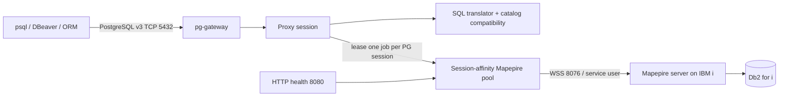

# PostgreSQL → IBM i (Mapepire) Proxy

A Node.js/TypeScript microservice that accepts PostgreSQL v3 wire-protocol connections and executes translated SQL against **Db2 for IBM i** through **Mapepire WebSockets**.

## Authentication model

The proxy deliberately separates the two identities:

- **PostgreSQL client identity** — `PG_PROXY_USER` / `PG_PROXY_PASSWORD`, validated locally by `pg-gateway`.
- **IBM i service identity** — `IBMI_USER` / `IBMI_PASSWORD`, used by every Mapepire backend job.

Client passwords are never forwarded to IBM i. This is a key architectural simplification of the proxy.

## Runtime architecture



## Why a session-affinity pool?

`@ibm/mapepire-js` recommends pooling for production. PostgreSQL sessions also need transaction affinity: all statements between `BEGIN` and `COMMIT/ROLLBACK` must execute on the same Db2 job. The project therefore pre-creates `SQLJob` objects and leases exactly one to each PostgreSQL connection. On release it performs a defensive `ROLLBACK` and resets `CURRENT SCHEMA`.

## Quick start

1. Copy/edit `.env` (a safe placeholder file is already included).
2. Set `IBMI_HOST`, `IBMI_USER`, `IBMI_PASSWORD`, `DEFAULT_SCHEMA` and proxy credentials.
3. Ensure the Mapepire server is reachable on `MAPEPIRE_PORT` (default 8076).
4. Build and run:

```bash
podman build -t postgres-mapepire-proxy:0.1.9 -f Containerfile .
podman run --rm --env-file .env -p 5432:5432 -p 8080:8080 postgres-mapepire-proxy:0.1.9
```

During the image build, `scripts/verify-runtime-modules.mjs` validates the actual installed entry points for Mapepire, node-sql-parser, dotenv/config and pg-gateway. This catches CommonJS/ESM packaging incompatibilities before the runtime image is produced. After TypeScript compilation, the build also runs pgAdmin startup, browser/schema, psycopg3 Extended Query wire, and PostgreSQL startup-handshake contracts.

5. Test:

```bash
PGPASSWORD='<PG_PROXY_PASSWORD>' psql -h 127.0.0.1 -p 5432 -U proxyuser -d ibmi -c 'select * from MYLIB.MYTABLE fetch first 5 rows only'
curl http://127.0.0.1:8080/readyz
```

## Scope

Implemented baseline:

- PostgreSQL startup/TLS/authentication through `pg-gateway`; after authentication the socket is detached to the proxy's incremental frame parser for Query/Parse/Bind/Execute/Sync.
- Simple Query protocol.
- Extended Query protocol: Parse, Bind, Describe, Execute, Sync, Close.
- Text result format; common binary input parameters for numeric/boolean types. `bytea` bind parameters are deliberately rejected in v0.1 until validated end-to-end against the Mapepire daemon.
- `$1` parameters → Mapepire `?` parameters.
- `LIMIT/OFFSET`, common `::type` casts and basic PostgreSQL function rewrites.
- `information_schema` → IBM i `SYSIBM` catalog mapping.
- `pg_namespace` / `pg_class` compatibility via `QSYS2.SYSSCHEMAS` / `QSYS2.SYSTABLES` derived tables.
- Synthetic baseline `pg_type` OID set.
- PostgreSQL transaction state mapped to a pinned Db2 session.
- Mapepire transport retry disabled by default; optional retry is limited to read-classified statements outside explicit transactions.
- Db2 metadata → PostgreSQL RowDescription/OIDs.
- Health/readiness HTTP endpoints.
- Multi-architecture container build for amd64 and ppc64le.

This is intentionally a **compatibility proxy**, not an implementation of the PostgreSQL SQL engine. See `docs/COMPATIBILITY.md` before using complex ORMs.

## Documentation

- `docs/TECHNICAL_SPECIFICATION.md` — architecture and implementation details.
- `docs/IMPLEMENTATION_PLAN.md` — phased implementation and hardening plan.
- `docs/DEPLOYMENT.md` — separate deployment/runbook document.
- `docs/CONFIGURATION.md` — complete `.env` variable reference.
- `docs/COMPATIBILITY.md` — supported PostgreSQL behavior and known gaps.
- `docs/SECURITY.md` — service-user and TLS security model.
- `docs/TESTING.md` — build/test and interoperability validation.
- `docs/SOURCES.md` — upstream references and version decisions.
- `docs/VALIDATION.md` — validation performed on this delivered package.
- `diagrams/*.mmd` — Mermaid source diagrams.


## Important v0.1 limitations

`SAVEPOINT`/`ROLLBACK TO SAVEPOINT`, PostgreSQL `CancelRequest`, binary result format and full PostgreSQL catalog emulation are not implemented. Common client `SET statement_timeout`/`lock_timeout` initialization commands are accepted as no-ops; they do not cancel IBM i work. See `docs/COMPATIBILITY.md`.


## Table browser and PostgreSQL SERIAL compatibility (0.1.9)

Release 0.1.9 backs pgAdmin's **Tables** collection with live IBM i `QSYS2.SYSTABLES` data and stable virtual PostgreSQL table OIDs. pgAdmin's table count, node, property and post-create lookup SQL is handled before the generic PostgreSQL-system firewall, so PostgreSQL-only trigger/inheritance/`EXISTS` expressions are not sent to Db2 for i.

PostgreSQL `SMALLSERIAL`/`SERIAL`/`BIGSERIAL` column pseudo-types are translated to Db2 for i `SMALLINT`/`INTEGER`/`BIGINT GENERATED BY DEFAULT AS IDENTITY`. Basic pgAdmin `ALTER TABLE ... OWNER TO ...` statements are acknowledged locally because backend ownership remains the configured IBM i Mapepire service profile.

## pgAdmin 4 compatibility (0.1.8)

The proxy implements a Virtual PostgreSQL System Layer audited against pgAdmin 4 9.17. Release 0.1.8 extends that contract beyond login into the database/schema browser: dashboard rows, database ACL/default-ACL dictionaries, role/tablespace descriptions, scheduler probes, and schema nodes/properties/ACLs now return the exact pgAdmin field shapes. Schema discovery is backed by live `QSYS2.SYSSCHEMAS`, while normal application SQL continues through Mapepire. Basic pgAdmin `CREATE SCHEMA ... AUTHORIZATION ...` is translated to IBM i service-user DDL. See `docs/PGADMIN_COMPATIBILITY.md`.

For pgAdmin 9.17 use `PG_SERVER_VERSION=14.0`; if reusing an `.env` from 0.1.5 or earlier, update that value explicitly.
