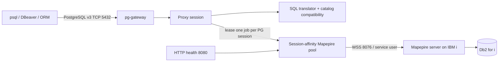

# PostgreSQL → IBM i (Mapepire) Proxy

A Node.js/TypeScript microservice that accepts PostgreSQL v3 wire-protocol connections and executes translated SQL against **Db2 for IBM i** through **Mapepire WebSockets**.

## Authentication model

The proxy deliberately separates the two identities:

- **PostgreSQL client identity** — `PG_PROXY_USER` / `PG_PROXY_PASSWORD`, validated locally by `pg-gateway`.
- **IBM i service identity** — `IBMI_USER` / `IBMI_PASSWORD`, used by every Mapepire backend job.

Client passwords are never forwarded to IBM i. This is a key architectural simplification of the proxy.

## Runtime architecture



## Why a session-affinity pool?

`@ibm/mapepire-js` recommends pooling for production. PostgreSQL sessions also need transaction affinity: all statements between `BEGIN` and `COMMIT/ROLLBACK` must execute on the same Db2 job. The project therefore pre-creates `SQLJob` objects and leases exactly one to each PostgreSQL connection. On release it performs a defensive `ROLLBACK` and resets `CURRENT SCHEMA`.

## Quick start

1. Copy/edit `.env` (a safe placeholder file is already included).
2. Set `IBMI_RDB_NAME`, `IBMI_HOST`, `IBMI_USER`, `IBMI_PASSWORD`, `IBMI_CURRENT_SCHEMA` and proxy credentials. `IBMI_RDB_NAME` is the *LOCAL relational database name shown by `WRKRDBDIRE`; `IBMI_CURRENT_SCHEMA` is the IBM i SQL schema/library used as the initial current schema. `DEFAULT_SCHEMA` remains a compatibility alias.
3. Ensure the Mapepire server is reachable on `MAPEPIRE_PORT` (default 8076).
4. Build and run:

```bash
podman build -t postgres-mapepire-proxy:0.1.20 -f Containerfile .
podman run --rm --env-file .env -p 5432:5432 -p 8080:8080 postgres-mapepire-proxy:0.1.20
```

During the image build, `scripts/verify-runtime-modules.mjs` validates the actual installed entry points for Mapepire, node-sql-parser, dotenv/config and pg-gateway. This catches CommonJS/ESM packaging incompatibilities before the runtime image is produced. After TypeScript compilation, the build also runs pgAdmin startup, browser/schema, psycopg3 Extended Query wire, and PostgreSQL startup-handshake contracts.

5. Test:

```bash
PGPASSWORD='<PG_PROXY_PASSWORD>' psql -h 127.0.0.1 -p 5432 -U proxyuser -d ibmi -c 'select * from MYLIB.MYTABLE fetch first 5 rows only'
curl http://127.0.0.1:8080/readyz
```

## Scope

Implemented baseline:

- PostgreSQL startup/TLS/authentication through `pg-gateway`; after authentication the socket is detached to the proxy's incremental frame parser for Query/Parse/Bind/Execute/Sync.
- Simple Query protocol.
- Extended Query protocol: Parse, Bind, Describe, Execute, Sync, Close.
- Text result format; common binary input parameters for numeric/boolean types. `bytea` bind parameters are deliberately rejected in v0.1 until validated end-to-end against the Mapepire daemon.
- `$1` parameters → Mapepire `?` parameters.
- `LIMIT/OFFSET`, common `::type` casts and basic PostgreSQL function rewrites.
- `information_schema` → IBM i `SYSIBM` catalog mapping.
- `pg_namespace` / `pg_class` compatibility via `QSYS2.SYSSCHEMAS` / `QSYS2.SYSTABLES` derived tables.
- Synthetic baseline `pg_type` OID set.
- PostgreSQL transaction state mapped to a pinned Db2 session.
- Mapepire transport retry disabled by default; optional retry is limited to read-classified statements outside explicit transactions.
- Db2 metadata → PostgreSQL RowDescription/OIDs.
- Health/readiness HTTP endpoints.
- Multi-architecture container build for amd64 and ppc64le.

This is intentionally a **compatibility proxy**, not an implementation of the PostgreSQL SQL engine. See `docs/COMPATIBILITY.md` before using complex ORMs.

## Documentation

- `docs/TECHNICAL_SPECIFICATION.md` — architecture and implementation details.
- `docs/IMPLEMENTATION_PLAN.md` — phased implementation and hardening plan.
- `docs/DEPLOYMENT.md` — separate deployment/runbook document.
- `docs/CONFIGURATION.md` — complete `.env` variable reference.
- `docs/COMPATIBILITY.md` — supported PostgreSQL behavior and known gaps.
- `docs/SECURITY.md` — service-user and TLS security model.
- `docs/TESTING.md` — build/test and interoperability validation.
- `docs/SOURCES.md` — upstream references and version decisions.
- `docs/VALIDATION.md` — validation performed on this delivered package.
- `diagrams/*.mmd` — Mermaid source diagrams.


## pgAdmin Columns, Indexes and Views (0.1.17)

Release 0.1.17 fixes the pgAdmin 9.16+ Columns node contract and extends IBM i index discovery. pgAdmin first executes a `count.sql`/`has_nodes()` probe before showing the **Columns** or **Indexes** collection; those probes are answered from live IBM i metadata. Columns use `QSYS2.SYSCOLUMNS2`. Indexes use `QSYS2.SYSINDEXES` first and, when that SQL `CREATE INDEX` catalog is empty, fall back to `QSYS2.SYSTABLEINDEXSTAT` for `INDEX` and DDS `LOGICAL` access paths.

The **Views** collection is now backed by live IBM i catalogs. SQL views are discovered with `QSYS2.SYSTABLES` where `TABLE_TYPE='V'` and enriched from `QSYS2.SYSVIEWS`, including the view definition. Views receive stable virtual PostgreSQL OIDs, so their **Columns** collection is resolved through the same `QSYS2.SYSCOLUMNS2` path as table columns. A pgAdmin refresh therefore exposes views created directly on IBM i with `CREATE VIEW`.


## SQLAlchemy / psycopg startup compatibility (0.1.18)

Release 0.1.18 adds the PostgreSQL bootstrap queries used by SQLAlchemy 2.0 with psycopg, including `SELECT pg_catalog.version()`, `SELECT current_schema()`, `SHOW transaction isolation level`, and `SHOW standard_conforming_strings`. This allows SQLAlchemy clients such as IBM MCP ContextForge to complete PostgreSQL dialect initialization through the proxy instead of receiving a NULL server-version scalar. The reported compatibility version follows `PG_SERVER_VERSION` (default `14.0`).

## psycopg nested-transaction compatibility (0.1.19)

Release 0.1.19 adds real Db2 for i-backed savepoints for psycopg nested `Connection.transaction()` contexts. PostgreSQL `SAVEPOINT`, `RELEASE [SAVEPOINT]`, and `ROLLBACK TO [SAVEPOINT]` commands are normalized to Db2 for i syntax on the same session-affinity Mapepire job. The release also virtualizes psycopg's optional `hstore` `TypeInfo.fetch()` query as an exact empty result, which is the correct behavior when the PostgreSQL extension is absent. This completes the next SQLAlchemy 2.0.51 / psycopg 3.3.4 first-connect stage used by ContextForge v1.0.7.

## pgAdmin Tables regression fix (0.1.15)

Release 0.1.15 fixes a regression introduced by the 0.1.14 table-child adapter. Normal pgAdmin Tables node SQL contains nested `pg_trigger` queries for trigger counts; those are no longer mistaken for a Triggers child collection. Trigger/Rule/Policy child interception now requires a concrete numeric parent table OID.

## pgAdmin schema filtering and table children (0.1.14)

Release 0.1.14 adds `PGADMIN_HIDE_SYSTEM_SCHEMAS=true` by default. pgAdmin schema navigation omits IBM i schemas/libraries whose names begin with `Q` or `SYS`, plus `INFORMATION_SCHEMA`; set the variable to `false` to expose them. `IBMI_CURRENT_SCHEMA` is now the preferred explicit setting for the initial Db2 current schema; `DEFAULT_SCHEMA` remains a backward-compatible fallback.

The pgAdmin table child browser is now IBM i-backed for **Columns** (`QSYS2.SYSCOLUMNS2`) and SQL **Indexes** (`QSYS2.SYSINDEXES`). PostgreSQL-only partition/inheritance child nodes are returned as an exact empty pgAdmin contract. This prevents PostgreSQL `::OID` casts from reaching Db2 for i as an attempted user-defined type named `OID`.

## PostgreSQL database ↔ IBM i RDB mapping (0.1.12)

One proxy instance represents one IBM i relational database. Set `IBMI_RDB_NAME` to the *LOCAL RDB name shown by `WRKRDBDIRE`. PostgreSQL clients must request that database name; arbitrary database labels are rejected with SQLSTATE `3D000`.

For pgAdmin, use the same value for **Maintenance database**. The IBM i library/schema is a different level and belongs in `IBMI_CURRENT_SCHEMA` (for example `IBMI_RDB_NAME=MYRDB`, `IBMI_CURRENT_SCHEMA=MONAI`).

Release 0.1.12 also fixes an empty-Schemas pgAdmin 9.17 regression where the schema nodes query was mistaken for a lookup of `pg_catalog` because pgAdmin embeds `nspname='pg_catalog'` inside its catalog-exclusion macro. Schema count/nodes/properties are now recognized from their primary `pg_namespace` relation and backed by live `QSYS2.SYSSCHEMAS`.

## Important v0.1 limitations

PostgreSQL `CancelRequest`, binary result format and full PostgreSQL catalog emulation are not implemented. Common client `SET statement_timeout`/`lock_timeout` initialization commands are accepted as no-ops; they do not cancel IBM i work. See `docs/COMPATIBILITY.md`.


## pgAdmin table discovery reliability (0.1.10)

Release 0.1.12 fixes the remaining pgAdmin database-initialization and Tables-tree issues observed after 0.1.9:

- pgAdmin's pgAgent capability probe (`has_table_privilege` / nested `WHERE EXISTS`) is answered locally as `false` and never sent to Db2 for i.
- The live IBM i Tables catalog now uses the documented `QSYS2.SYSTABLES.FILE_TYPE = 'D'` filter with `TABLE_TYPE IN ('T','P')`, excluding source physical files without relying on a non-portable catalog column.
- Table-browser schema lookup accepts both the current stable synthetic schema OID and the pre-0.1.8 row-number OID, protecting refreshes from stale pgAdmin browser nodes after an upgrade.
- DEBUG logs now show each pgAdmin table catalog request with request kind, requested schema OID/name, resolved IBM i schema and table count.

## Table browser and PostgreSQL SERIAL compatibility (0.1.9)

Release 0.1.9 backs pgAdmin's **Tables** collection with live IBM i `QSYS2.SYSTABLES` data and stable virtual PostgreSQL table OIDs. pgAdmin's table count, node, property and post-create lookup SQL is handled before the generic PostgreSQL-system firewall, so PostgreSQL-only trigger/inheritance/`EXISTS` expressions are not sent to Db2 for i.

PostgreSQL `SMALLSERIAL`/`SERIAL`/`BIGSERIAL` column pseudo-types are translated to Db2 for i `SMALLINT`/`INTEGER`/`BIGINT GENERATED BY DEFAULT AS IDENTITY`. Basic pgAdmin `ALTER TABLE ... OWNER TO ...` statements are acknowledged locally because backend ownership remains the configured IBM i Mapepire service profile.

## pgAdmin 4 compatibility (0.1.8)

The proxy implements a Virtual PostgreSQL System Layer audited against pgAdmin 4 9.17. Release 0.1.8 extends that contract beyond login into the database/schema browser: dashboard rows, database ACL/default-ACL dictionaries, role/tablespace descriptions, scheduler probes, and schema nodes/properties/ACLs now return the exact pgAdmin field shapes. Schema discovery is backed by live `QSYS2.SYSSCHEMAS`, while normal application SQL continues through Mapepire. Basic pgAdmin `CREATE SCHEMA ... AUTHORIZATION ...` is translated to IBM i service-user DDL. See `docs/PGADMIN_COMPATIBILITY.md`.

For pgAdmin 9.17 use `PG_SERVER_VERSION=14.0`; if reusing an `.env` from 0.1.5 or earlier, update that value explicitly.

## ContextForge advisory-lock compatibility (0.1.20)

ContextForge v1.0.7 serializes database bootstrap with PostgreSQL session advisory locks. Release 0.1.20 implements `pg_try_advisory_lock(bigint)`, `pg_advisory_unlock(bigint)`, and `pg_advisory_unlock_all()` inside the proxy. The lock registry is session-scoped and re-entrant, and locks are automatically released when the owning PostgreSQL TCP session closes. This prevents the generic PostgreSQL-system compatibility firewall from returning NULL for `pg_try_advisory_lock()`, which previously caused every ContextForge worker to wait forever for a lock that no worker could acquire.
