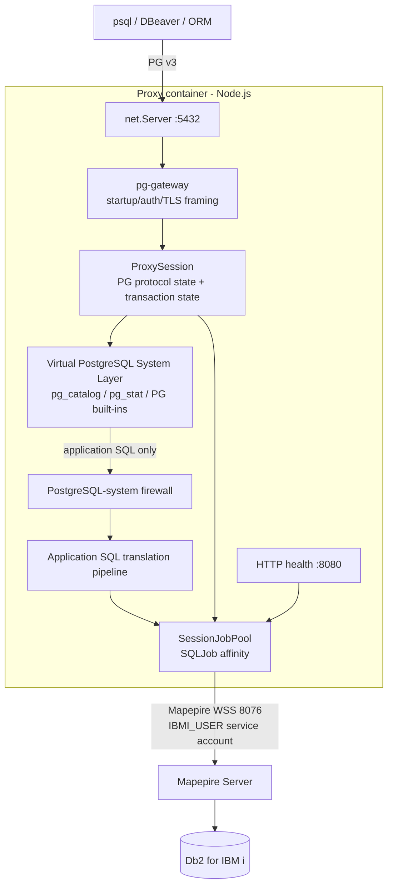
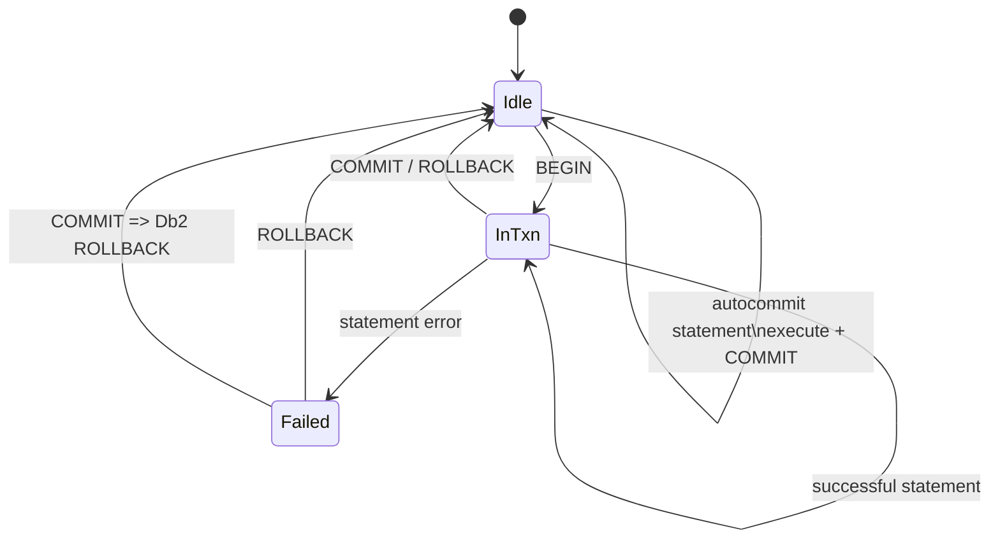

# Technical Specification — PostgreSQL → IBM i Mapepire Proxy

## 1. Executive summary

The service exposes PostgreSQL protocol v3 on TCP/5432 and translates supported PostgreSQL SQL/protocol operations to Db2 for IBM i requests issued with `@ibm/mapepire-js` over secure WebSockets. It is written in TypeScript/ESM and contains no project-specific native extension requirement, allowing the same application artifact to run on x86-64 and IBM Power ppc64le official Node images.

A major design decision is that **IBM i authentication is performed only with a service profile stored in `.env`**. PostgreSQL client credentials are local proxy credentials and are never used to establish Mapepire sessions.

## 2. Component architecture

## 3. Identity and authentication

### PostgreSQL side

`pg-gateway` validates one proxy-local identity configured by `PG_PROXY_USER` and `PG_PROXY_PASSWORD`. `PG_AUTH_MODE` supports `md5Password`, `cleartextPassword`, or `none`. Production should prefer PostgreSQL-side TLS whenever cleartext authentication is selected. `PG_MAX_FRONTEND_MESSAGE_BYTES` bounds the memory used for a single post-authentication frontend protocol message.

### IBM i side

Every Mapepire `SQLJob` uses:

- `IBMI_HOST`
- `MAPEPIRE_PORT`
- `IBMI_USER`
- `IBMI_PASSWORD`
- `MAPEPIRE_REJECT_UNAUTHORIZED`
- optional `MAPEPIRE_CA_FILE`

This service profile determines all IBM i authority. Client usernames are application/audit metadata only and do not change Db2 authorization.

## 4. Mapepire connection management

`@ibm/mapepire-js` provides `SQLJob` and its own general-purpose `Pool`. The proxy requires **session affinity**, so it implements `SessionJobPool` around persistent `SQLJob` objects:

1. At startup create `MAPEPIRE_POOL_STARTING_SIZE` jobs.
2. Each authenticated PostgreSQL connection leases one job.
3. All SQL for that connection executes on the same job.
4. Pool expands up to `MAPEPIRE_POOL_MAX_SIZE`.
5. Additional PostgreSQL sessions wait up to `MAPEPIRE_POOL_ACQUIRE_TIMEOUT_MS`.
6. On session release: `ROLLBACK`, reset `CURRENT SCHEMA`, then return job to idle queue.
7. Transport-broken jobs are discarded and replenished.

This prevents transaction leakage and avoids per-query WebSocket/JDBC startup cost.

### JDBC properties

The `.env` exposes the performance/session properties used by this proxy: SQL naming, optional IBM i library list, ISO date/time formatting, decimal separator, auto-commit, isolation, block size, data compression, prefetch, extended metadata, keep-alive, JDBC query-timeout mechanism, optional query storage limit and `MAPEPIRE_FETCH_SIZE` for cursor paging. The JDBC timeout-mechanism property must not be confused with PostgreSQL `statement_timeout`: proxy v0.1 does not cancel an already-running Mapepire query.

`MAPEPIRE_JDBC_AUTO_COMMIT=false` is the recommended setting. The proxy explicitly commits implicit PostgreSQL-autocommit statements and preserves explicit transaction blocks.

### Session-state containment

Because backend jobs are reused under one IBM i service identity, the proxy must not allow arbitrary PostgreSQL `SET` commands to leave state behind for a later client. v0.1 explicitly handles `search_path` and a small set of client-initialization settings; unsupported `SET` options return SQLSTATE `0A000`. Job release always performs a defensive `ROLLBACK` and restores `DEFAULT_SCHEMA`. Savepoints are also explicitly rejected in v0.1 rather than approximated.

### Retry policy

`MAPEPIRE_RECONNECT_RETRIES` defaults to `0`. If explicitly enabled, retries are restricted to syntactically read-only statements outside an explicit transaction and only after a transport-level failure. Since a SELECT can call a user-defined routine with side effects, administrators should enable retries only when the application workload is known to be safe to replay. Writes are never automatically replayed.

## 5. PostgreSQL wire protocol

`pg-gateway` 0.2.4 handles StartupMessage, optional TLS negotiation and proxy-local authentication. Its 0.2.x query path is intentionally not used: after successful authentication, the proxy calls `detach()` and owns the authenticated socket. The proxy parser then incrementally reassembles PostgreSQL frontend frames and dispatches Query/Parse/Bind/Describe/Execute/Sync/Close/Terminate. This avoids coupling correctness to TCP packet boundaries and avoids the incomplete `onQuery` path in pg-gateway 0.2.x.

### Simple Query

`Q` → translate → execute → RowDescription/DataRow(s) → CommandComplete → ReadyForQuery.

### Extended Query

Supported frontend messages:

- `P` Parse — stores named/unnamed SQL and declared parameter OIDs.
- `B` Bind — decodes parameter values and creates a portal.
- `D` Describe — ParameterDescription plus `NoData`; Mapepire produces definitive result metadata at execution time.
- `E` Execute — executes the portal and returns result frames.
- `S` Sync — returns ReadyForQuery.
- `C` Close — closes local statement/portal metadata.
- `H` Flush — no-op because responses are immediately written.
- `X` Terminate — releases the Mapepire lease.

Result data is emitted in PostgreSQL text format. Common binary parameter encodings are decoded for bool, int2/int4/int8 and float4/float8. `bytea` bind parameters are rejected in v0.1; BLOB/binary result values are still serialized as PostgreSQL `bytea` text (`\x...`). Extended-protocol errors enter the PostgreSQL error-recovery state: messages are ignored until `Sync`, then `ReadyForQuery` is emitted. Mapepire result sets are fetched in pages using `execute(rows)` / `fetchMore(rows)`; the page size is controlled by `MAPEPIRE_FETCH_SIZE`.

## 6. Transaction mapping

The PostgreSQL connection owns one Mapepire job, therefore all work in a transaction stays in one Db2 session. An error inside a transaction sets ReadyForQuery state `E`; subsequent statements fail with `25P02` until rollback/commit resolution.

## 7. SQL translation pipeline

Order:

1. Split Simple Query batches and allow a multi-statement batch only when every statement is handled locally, unless general multi-statement SQL is explicitly enabled.
2. Resolve PostgreSQL environment/session commands locally.
3. Resolve pgAdmin/PostgreSQL server-internal SQL through the **Virtual PostgreSQL System Layer**.
4. Apply the **PostgreSQL-system firewall**: an unhandled `pg_catalog.*`, `pg_stat_*`, replication/lock/settings/system query is never forwarded to IBM i.
5. `$n` → `?` and retain parameter reorder map.
6. PostgreSQL cast shorthand → `CAST` for conservative common cases.
7. `LIMIT/OFFSET` → Db2 `OFFSET ... ROWS FETCH FIRST ... ROWS ONLY`.
8. Function compatibility (`now()`, `current_schema()`, etc.).
9. `information_schema` and supported catalog-derived rewrites.
10. For scalar application `SELECT` statements with no top-level `FROM`, add `FROM SYSIBM.SYSDUMMY1` before forwarding to Db2.
11. Optional uppercase normalization for unquoted SQL.

`node-sql-parser` is used as a secondary statement classifier, not as the sole translator. Metadata SQL produced by tools is frequently vendor-specific and regex/rule-based interception is more predictable for the targeted compatibility set.

## 8. Catalog and virtual PostgreSQL system strategy

The proxy deliberately separates metadata into two categories:

1. **Portable/application metadata** can be derived from IBM i catalogs.
2. **PostgreSQL-server internals** have no Db2 equivalent and are virtualized locally. They must never be translated into similarly named IBM i objects.

| PostgreSQL object/family | Proxy implementation |
|---|---|
| `information_schema.tables` | `SYSIBM.TABLES` |
| `information_schema.columns` | `SYSIBM.COLUMNS` |
| `information_schema.schemata` | `SYSIBM.SCHEMATA` |
| `pg_catalog.pg_namespace` | derived table over `QSYS2.SYSSCHEMAS` with synthetic OID |
| `pg_catalog.pg_class` | derived table over `QSYS2.SYSTABLES` with synthetic OID / relkind |
| `pg_catalog.pg_type` | static in-memory supported OID set |
| `pg_catalog.pg_database` | local synthetic database metadata |
| `pg_catalog.pg_roles` / `pg_user` | local proxy-role capability metadata |
| `pg_catalog.pg_stat_gssapi` / `pg_stat_ssl` | local connection-security metadata |
| recovery/WAL functions | stable synthetic non-recovery values |
| `pg_stat_*`, locks, replication, prepared-xact monitoring | local empty/projected virtual result unless explicitly implemented |
| unknown PostgreSQL system object | quarantined by the system firewall; never sent to Mapepire |

The pgAdmin 9.17 compatibility profile exposes PostgreSQL `14.0`, the lowest PostgreSQL major supported by that pgAdmin release. This intentionally reduces version-dependent PostgreSQL catalog surface. `PG_SERVER_VERSION` is a wire-protocol compatibility declaration, not a claim that Db2 for i implements PostgreSQL 14 server internals.

Synthetic OIDs and virtual server identifiers are compatibility identifiers only. They must not be persisted by applications as durable PostgreSQL catalog object identifiers.

## 9. Type mapping

| Db2 for i | PostgreSQL OID | PostgreSQL type |
|---|---:|---|
| SMALLINT | 21 | int2 |
| INTEGER | 23 | int4 |
| BIGINT | 20 | int8 |
| DECIMAL / NUMERIC / DECFLOAT | 1700 | numeric |
| REAL | 700 | float4 |
| FLOAT / DOUBLE | 701 | float8 |
| VARCHAR | 1043 | varchar |
| CHAR(n) | 1042 | bpchar |
| CLOB / graphic / fallback text | 25 | text |
| DATE | 1082 | date |
| TIME | 1083 | time |
| TIMESTAMP | 1114 | timestamp |
| BLOB / binary | 17 | bytea |

Mapepire performs IBM i CCSID conversion before values reach Node.js; the proxy serializes text values as UTF-8 PostgreSQL payloads.

## 10. Error model

Where Mapepire/Db2 exposes a five-character SQLSTATE it is propagated as the PostgreSQL ErrorResponse code. Otherwise the proxy emits a generic SQLSTATE and includes Db2 diagnostic text. Transaction state is changed to failed only when the client is inside an explicit transaction.

A transport retry is allowed only when all conditions hold:

- statement is an idempotent read;
- no explicit PostgreSQL transaction is active;
- failure resembles transport/WebSocket/network loss;
- retry count remains below `MAPEPIRE_RECONNECT_RETRIES`.

Writes are never automatically replayed.

## 11. Health model

HTTP endpoints:

- `/healthz` — process liveness.
- `/readyz` — PostgreSQL listener active and Mapepire pool healthy.
- `/stats` — pool counts for operations/troubleshooting.

The container HEALTHCHECK calls `/readyz`.

## 12. Multi-architecture packaging

Base image: official Docker Hub `node:24-bookworm-slim` (Node 24 LTS). The tag currently publishes both amd64 and ppc64le variants; deployments that require bit-for-bit reproducibility can override `NODE_IMAGE` with a tested immutable digest. Build scripts are supplied for Docker buildx and Podman manifests targeting:

- `linux/amd64`
- `linux/ppc64le`

The runtime executes as the non-root `node` user/group (UID/GID 1000) provided by the official Node image.

## 13. Implementation phases

1. **Foundation** — TypeScript/ESM, config validation, logging, container.
2. **Backend** — service-user Mapepire jobs and session-affinity pooling.
3. **Protocol** — PG auth, simple and extended query messages.
4. **Translation** — dialect transforms and parameters.
5. **Catalog** — SYSIBM/QSYS2 rewrites and synthetic OIDs.
6. **Serialization** — RowDescription/OID and DataRow encoding.
7. **Transactions/errors** — pinned job, SQLSTATE, safe retries.
8. **Operations** — health/readiness, graceful shutdown, multi-arch build.
9. **Interoperability hardening** — capture DBeaver/ORM metadata queries and add deterministic compatibility handlers as required.
